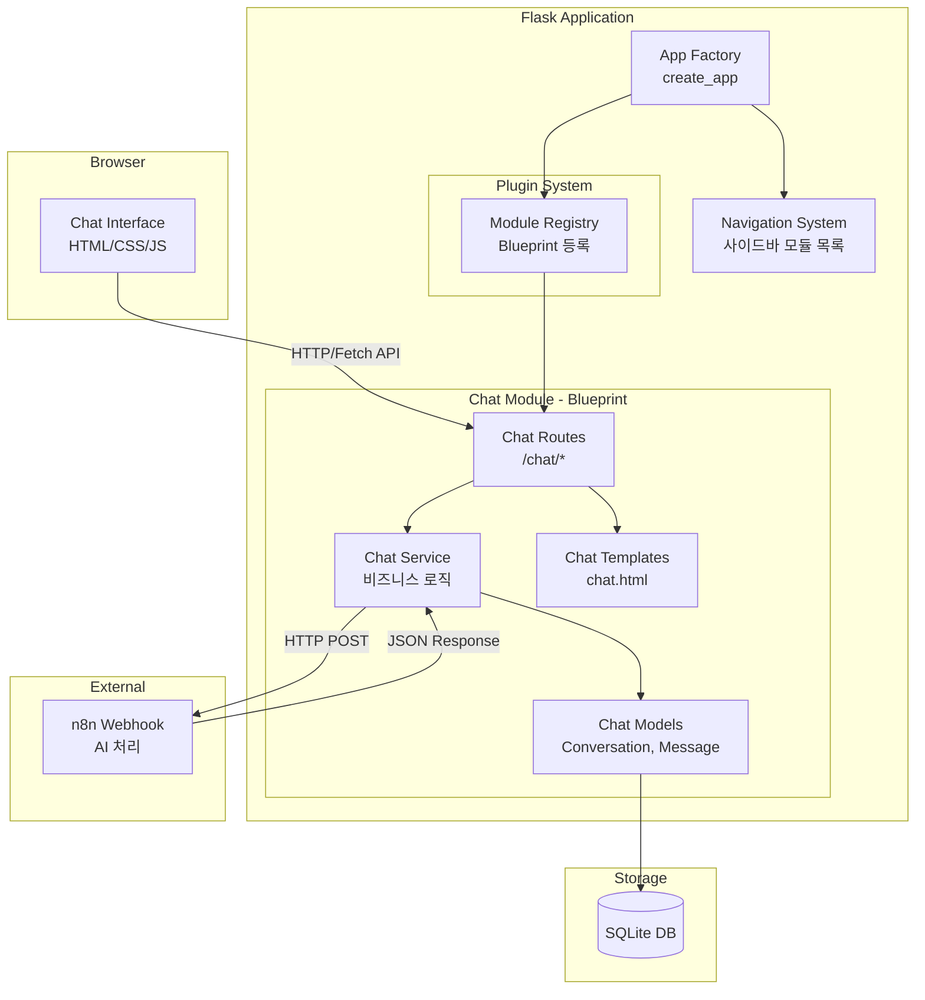

# Design Document: Personal Workspace Server

## Overview

개인 업무용 웹 서버로, Flask Blueprint 기반의 모듈형 플러그인 아키텍처를 사용한다. 첫 번째 모듈로 Open WebUI 스타일의 채팅 인터페이스를 구현하며, 백엔드는 n8n webhook을 통해 AI 응답을 처리한다. SQLite를 사용하여 대화 데이터를 영속 저장하고, Jinja2 템플릿과 바닐라 CSS/JS로 Apple/Notion 스타일의 미니멀 UI를 구현한다.

### 기술 스택

- **Backend**: Python 3.13+, Flask
- **Frontend**: Jinja2 Templates, Vanilla CSS, Vanilla JavaScript
- **Database**: SQLite (via Flask-SQLAlchemy 또는 직접 sqlite3)
- **HTTP Client**: requests (n8n webhook 호출)
- **Testing**: pytest, Hypothesis (property-based testing)

## Architecture



### 디렉토리 구조

```
personal-workspace/
├── app/
│   ├── __init__.py              # App Factory (create_app)
│   ├── config.py                # 설정 관리
│   ├── models/
│   │   └── base.py              # DB 초기화, Base 모델
│   ├── static/
│   │   ├── css/
│   │   │   └── main.css         # 공통 스타일 (미니멀 화이트 테마)
│   │   └── js/
│   │       └── main.js          # 공통 JS
│   ├── templates/
│   │   └── base.html            # 기본 레이아웃 (사이드바 + 콘텐츠)
│   └── modules/
│       └── chat/
│           ├── __init__.py      # Blueprint 정의
│           ├── routes.py        # 라우트 핸들러
│           ├── service.py       # 비즈니스 로직 (n8n 호출 등)
│           ├── models.py        # Conversation, Message 모델
│           ├── templates/
│           │   └── chat/
│           │       └── chat.html
│           └── static/
│               ├── css/
│               │   └── chat.css
│               └── js/
│                   └── chat.js
├── tests/
│   ├── conftest.py
│   ├── test_chat_service.py
│   └── test_chat_models.py
├── .env
├── requirements.txt
└── run.py                       # 엔트리포인트
```

## Components and Interfaces

### 1. App Factory (`app/__init__.py`)

앱 생성과 모듈 등록을 담당한다.

```python
def create_app(config_name=None):
    app = Flask(__name__)
    app.config.from_object(get_config(config_name))
    
    init_db(app)
    register_modules(app)
    
    return app

def register_modules(app):
    """등록된 모듈 Blueprint를 앱에 등록"""
    from app.modules.chat import chat_bp
    app.register_blueprint(chat_bp, url_prefix='/chat')
    
    # 사이드바 네비게이션용 모듈 메타데이터
    app.config['REGISTERED_MODULES'] = [
        {'name': 'Chat', 'icon': '💬', 'url': '/chat', 'id': 'chat'}
    ]
```

### 2. Config (`app/config.py`)

```python
class Config:
    SECRET_KEY: str
    DATABASE_PATH: str  # SQLite 파일 경로
    N8N_WEBHOOK_URL: str
    N8N_TIMEOUT: int = 30  # seconds
```

### 3. Module Registry Pattern

새 모듈 추가 시 패턴:

```python
# app/modules/new_feature/__init__.py
from flask import Blueprint

new_feature_bp = Blueprint('new_feature', __name__,
                           template_folder='templates',
                           static_folder='static')

from . import routes  # noqa
```

`create_app`에서 `app.register_blueprint(new_feature_bp, url_prefix='/new-feature')`로 등록하고, `REGISTERED_MODULES`에 메타데이터를 추가하면 사이드바에 자동 표시된다.

### 4. Chat Module

#### Routes (`modules/chat/routes.py`)

| Method | Path | Description |
|--------|------|-------------|
| GET | `/chat` | 채팅 메인 페이지 렌더링 |
| GET | `/chat/api/conversations` | 대화 목록 조회 |
| POST | `/chat/api/conversations` | 새 대화 생성 |
| DELETE | `/chat/api/conversations/<id>` | 대화 삭제 |
| GET | `/chat/api/conversations/<id>/messages` | 대화 메시지 조회 |
| POST | `/chat/api/conversations/<id>/messages` | 메시지 전송 (n8n 호출 포함) |

#### Service (`modules/chat/service.py`)

```python
class ChatService:
    def create_conversation(self) -> Conversation:
        """새 대화 생성"""
    
    def get_conversations(self) -> list[Conversation]:
        """모든 대화 목록 반환"""
    
    def delete_conversation(self, conversation_id: int) -> bool:
        """대화 및 관련 메시지 삭제"""
    
    def send_message(self, conversation_id: int, content: str) -> Message:
        """사용자 메시지 저장 후 n8n webhook 호출, AI 응답 저장 후 반환"""
    
    def get_messages(self, conversation_id: int) -> list[Message]:
        """대화의 메시지 목록 반환"""
    
    def _call_n8n_webhook(self, content: str, context: list[dict]) -> str:
        """n8n webhook HTTP POST 호출"""
```

### 5. Navigation System

`base.html` 템플릿에서 `app.config['REGISTERED_MODULES']`를 순회하며 사이드바를 렌더링한다. 현재 활성 모듈은 URL 매칭으로 강조 표시한다.

## Data Models

### Conversation

| Field | Type | Description |
|-------|------|-------------|
| id | INTEGER (PK) | 자동 증가 ID |
| title | TEXT | 대화 제목 (첫 메시지 기반 자동 생성) |
| created_at | TIMESTAMP | 생성 시각 |
| updated_at | TIMESTAMP | 마지막 업데이트 시각 |

### Message

| Field | Type | Description |
|-------|------|-------------|
| id | INTEGER (PK) | 자동 증가 ID |
| conversation_id | INTEGER (FK) | 소속 대화 ID |
| role | TEXT | 'user' 또는 'assistant' |
| content | TEXT | 메시지 내용 |
| created_at | TIMESTAMP | 생성 시각 |

### JSON 직렬화 형식

```json
{
  "id": 1,
  "conversation_id": 1,
  "role": "user",
  "content": "안녕하세요",
  "created_at": "2026-03-03T10:30:00"
}
```


## Correctness Properties

*A property is a characteristic or behavior that should hold true across all valid executions of a system—essentially, a formal statement about what the system should do. Properties serve as the bridge between human-readable specifications and machine-verifiable correctness guarantees.*

### Property 1: Message persistence round-trip

*For any* valid message (non-empty content, valid role of 'user' or 'assistant'), saving it to a conversation and then retrieving messages for that conversation should return a message with equivalent content, role, and a valid timestamp.

**Validates: Requirements 3.1, 6.1, 6.3**

### Property 2: Empty/whitespace message rejection

*For any* string composed entirely of whitespace characters (including empty string), attempting to send it as a message should be rejected, and the conversation's message count should remain unchanged.

**Validates: Requirements 3.2**

### Property 3: Conversation creation produces valid conversation

*For any* request to create a new conversation, the result should be a conversation with a valid ID, a creation timestamp, and an empty message list.

**Validates: Requirements 4.1**

### Property 4: Conversation deletion removes all associated data

*For any* conversation with messages, deleting the conversation should result in both the conversation and all its messages being unretrievable.

**Validates: Requirements 4.4**

### Property 5: Message retrieval returns correct conversation messages

*For any* set of conversations each with distinct messages, retrieving messages for a specific conversation should return exactly the messages belonging to that conversation, in chronological order.

**Validates: Requirements 4.3**

### Property 6: Webhook payload contains message and context

*For any* user message and conversation history, the webhook payload should contain the user's message content and the conversation context as a list of previous messages in JSON format.

**Validates: Requirements 5.2**

### Property 7: Webhook error handling

*For any* webhook failure (timeout, connection error, HTTP 4xx/5xx), the service should return an error response without crashing, and the user message should still be persisted.

**Validates: Requirements 5.4**

### Property 8: Message JSON serialization round-trip

*For any* valid Message object, serializing to JSON and deserializing back should produce an equivalent Message with the same id, conversation_id, role, content, and created_at.

**Validates: Requirements 6.4**

### Property 9: Data persistence across app restart

*For any* set of conversations and messages saved to the database, reinitializing the application (simulating restart) should allow retrieval of all previously saved data.

**Validates: Requirements 6.2**

## Error Handling

### n8n Webhook 오류

| 오류 유형 | 처리 방식 |
|-----------|-----------|
| Connection Error | "서버에 연결할 수 없습니다" 메시지 표시, 재시도 버튼 제공 |
| Timeout (30초) | "응답 시간이 초과되었습니다" 메시지 표시, 재시도 버튼 제공 |
| HTTP 4xx/5xx | "요청 처리 중 오류가 발생했습니다" 메시지 표시 |
| Invalid JSON Response | "응답을 처리할 수 없습니다" 메시지 표시 |

### 데이터 오류

| 오류 유형 | 처리 방식 |
|-----------|-----------|
| DB Write Failure | 사용자에게 오류 알림, 로그 기록 |
| Invalid Conversation ID | 404 응답 반환 |
| Empty Message | 400 응답 반환, 전송 차단 |

## Testing Strategy

### 테스트 프레임워크

- **Unit Testing**: pytest
- **Property-Based Testing**: Hypothesis
- **Test Runner**: pytest with hypothesis plugin

### Unit Tests

- 특정 예제와 엣지 케이스 검증
- API 라우트 응답 코드 및 형식 검증
- n8n webhook 호출 통합 테스트 (mock 사용)
- 설정 로딩 검증

### Property-Based Tests

- Hypothesis 라이브러리 사용
- 각 property test는 최소 100회 반복 실행
- 각 테스트에 설계 문서의 property 번호를 주석으로 태깅
- 태그 형식: `# Feature: personal-workspace-server, Property {number}: {title}`

### 테스트 구조

```
tests/
├── conftest.py              # 공통 fixture (test app, test db, test client)
├── test_chat_service.py     # ChatService unit + property tests
├── test_chat_models.py      # Model serialization property tests
└── test_chat_routes.py      # API route tests
```
